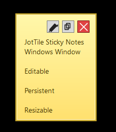
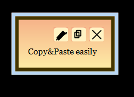
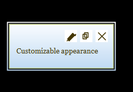
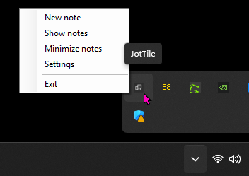

#  JotTile

    

JotTile is a small local WinForms sticky-note app for Windows. It keeps notes offline, restores them at sign-in, supports a tray-only idle state, and ships with a separate `config.exe` for appearance and behavior settings.

## Build and Run

Double-click `build.cmd` or run:

```powershell
powershell -ExecutionPolicy Bypass -File .\build.ps1
```

The script restores the solution, publishes `JotTile.exe` and `config.exe` as self-contained `win-x64` single-file executables, optionally creates a desktop shortcut, and places the uninstall launcher into `app\`.

Published output:

```text
app\JotTile.exe
app\config.exe
app\Uninstall JotTile.cmd
```

## Main Workflow

Create a new note by launching `app\JotTile.exe` or by right-clicking the Windows tray icon.



- A brand-new note opens in `Editing` mode.
- `Enter` inserts line breaks while you type.
- `Ctrl+S` or the Save button commits text and note size atomically.
- After a successful save, the note switches to `Saved` and auto-resizes to fit the committed text.
- `F2` or the Edit button re-enters editing.
- `Ctrl+C` copies the full saved note only in `Saved` mode.
- `Ctrl+W` follows the same close path as the Close button. By default it deletes the note instantly.

## Tray Behavior

The app uses the tray icon shown above. Choosing `Exit` closes the app and removes the tray icon.

Closing or deleting the last visible note does not terminate JotTile. The app can stay alive with zero open note windows until you exit it from the tray.

## Settings

`config.exe` manages global settings for all notes:

- note colors, gradients, frame and stroke colors/thicknesses
- a curated font selection for note text
- delete confirmation behavior
- exit confirmation and unsaved-exit behavior
- launch-at-sign-in

Saved settings are applied live to running notes through a local Windows event. No network connection is involved.

## Data, Migration, and Recovery

Current data paths:

```text
%APPDATA%\JotTile\notes.json
%APPDATA%\JotTile\settings.json
%LOCALAPPDATA%\JotTile\logs\app.log
```

Legacy notes under `%APPDATA%\SimpleStickyNotes\notes.json` are copied forward on first use if no new JotTile data file exists yet. The legacy file is never deleted automatically.

Persistence uses temp-file + replace semantics and keeps backups:

```text
notes.bak
settings.bak
```

If `notes.json` or `settings.json` becomes unreadable, JotTile attempts to recover from the matching backup and quarantines the corrupt file instead of crashing.

## Autostart

Autostart uses the current user Run key:

```text
HKCU\Software\Microsoft\Windows\CurrentVersion\Run
```

No administrator rights are required. The old `SimpleStickyNotes` Run value is cleaned up automatically.

## Uninstall

`app\Uninstall JotTile.cmd` removes:

- the JotTile autostart entry
- any leftover `SimpleStickyNotes` autostart entry
- desktop shortcuts pointing at this JotTile build
- the published app folder

It separately asks whether the stored notes should also be removed from:

```text
%APPDATA%\JotTile
%APPDATA%\SimpleStickyNotes
```

## Development

The repo is split into:

- `JotTile.Core` for persistence, settings, layout, logging, and note-state contracts
- `JotTile` for the main WinForms app
- `JotTile.Config` for `config.exe`
- `tests/JotTile.Tests` for xUnit coverage

The app stays intentionally local and small. There is no cloud sync, account system, network feature, plugin system, or telemetry.

## Keywords

- `Windows sticky notes app`, `offline notes app`, `desktop note app`, `post-it notes for Windows`, `notes app`,`note app`
- `WinForms`, `local`, `local-first`, `self-contained Windows app`, `tray note app`, `config.exe`, `xUnit`
